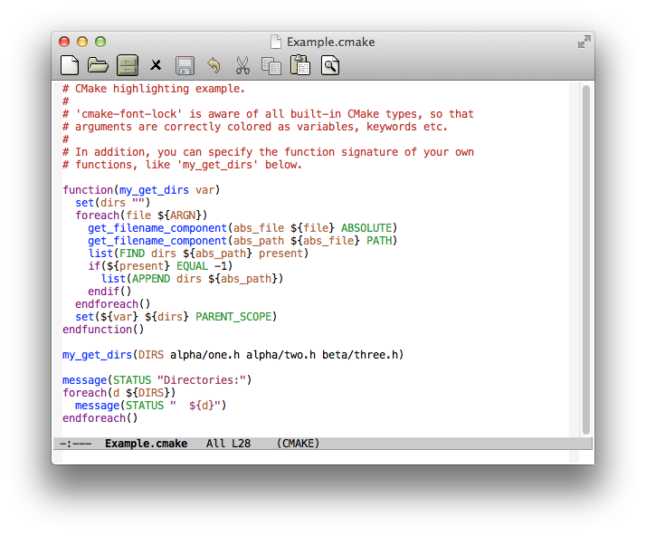

# andersl-cmake-font-lock - Syntax coloring support for CMake

*Author:* Anders Lindgren 
*Version:* 0.0.4 
*URL:* [https://github.com/Lindydancer/cmake-font-lock](https://github.com/Lindydancer/cmake-font-lock) 

Advanced syntax coloring support for CMake scripts.

The major feature of this package is to highlighting function
arguments according to their use. For example:

CMake, as a programming language, has a very simple syntax.
Unfortunately, this makes it hard to read CMake scripts. CMake
supports function calls, but they may not be nested. In addition,
the functions do not support return values like normal programming
languages, instead a function is capable of setting variables in
the scope of the parent. In other words, a parameter could be
anything like the name of a variable, a keyword, a property, or
even a plain string.

By highlighting each argument, CMake scripts becomes much easier to
read, and also to write.

This package is aware of all built-in CMake functions. In addition,
it allows you to add function signatures for your own functions.

## Installation

Place the file in a directory in Emacs' load path.

Add the following lines to a suitable init file, like ~/.emacs, to
enable this package:

    (autoload 'andersl-cmake-font-lock-activate "andersl-cmake-font-lock" nil t)
    (add-hook 'cmake-mode-hook 'andersl-cmake-font-lock-activate)

This package is designed to be used together with a major mode for
editing CMake files. Once such package is `cmake-mode.el`
distributed by Kitware, however this package is not dependent upon
or associated with any specific CMake major mode. (Note that the
Kitware package contains rudimentary syntax coloring support.)

## What is colored

* Comments and quoted strings.
* Special functions like `if`, `while`, `function`, and `include`
  are colored as font-lock *keywords* (not to be confused with
  keywords in the CMake sense).
* Other function name are colored as, well, *functions*.
* The arguments of functions are colored according to the type, as
  specified by the function *signature*. The built-in signatures
  can color an arguments as a *variable*, a *function*, a
  *property*, a *target*, a *policy*, and finally a CMake keyword
  is colored as a *type*.
* The constants `true`, `false`, `yes`, `no`, `y`, `n`, `on`, and
  `off` are colored as *constants*.
* `${...}` constructs are fontified as *variables*. Nested
  constructs are supported.
* For `$ENV{...}`, `ENV` is fontified as a *variable* and the
  content as a *constant*.
* For `$<name:...>` constructs, `name` is colored as a *constant*.
* For preprocessor definitions like `-DNAME`, `NAME` is colored as
  a *constant*.

## Customizing

In order to perform syntax coloring correctly, this package has to
be aware of the keywords and types of the CMake functions used. To
add information about non-standard CMake function, the following
functions can be used:

### `andersl-cmake-font-lock-add-keywords` -- Add keyword information

Adding the list of keywords to a function is a simple way to get
basic coloring correct. For most functions, this is sufficient.
For example:

        (andersl-cmake-font-lock-add-keywords
           "my-func" '("FILE" "RESULT" "OTHER"))

### `andersl-cmake-font-lock-set-signature` -- Set full function type

Set the signature (the type of the arguments) for a function. For
example:

        (andersl-cmake-font-lock-set-signature
           "my-func" '(:var nil :prop) '(("FILE" :file) ("RESULT" :var)))

### Custom types

The signatures of CMake functions provided by this package use a
number of types (see `andersl-cmake-font-lock-function-signatures`
for details). However, when adding new signatures, it's possible to
use additional types. In that case, the variable
`andersl-cmake-font-lock-argument-kind-face-alist` must be modified
to map the CMake type to a concrete Emacs face. For example:

    (andersl-cmake-font-lock-set-signature "my_warn" (:warning))
    (add-to-list '(:warning . font-lock-warning-face)
                 andersl-cmake-font-lock-argument-kind-face-alist)

## Problems

* In CMake, function taking expressions, like `if` and `while`,
  treat any string as the name of a variable, if one exists. This
  mode fontifies all such as variables, whether or not they
  actually refer to variable. You can quote the arguments to
  fontify them as strings (even though that will not prevent CMake
  from interpreting them as variables).
* Normally, keywords are written explicitly when calling a
  function. However, it is legal to assigning them to a variable,
  which is expanded at the time the function is called. In this
  case, remaining arguments will not be colored correctly. For
  example:

        set(def DEFINITION var2)
        get_directory_property(var1 ${def} my_property)

## Implementation notes

The list of CMake keywords,
`andersl-cmake-font-lock-function-keywords-alist`, is generated by
the script `ParseCMakeDocCommands.rb` from the CMake documentation.

---
Converted from `andersl-cmake-font-lock.el` by [*el2markdown*](https://github.com/Lindydancer/el2markdown).
